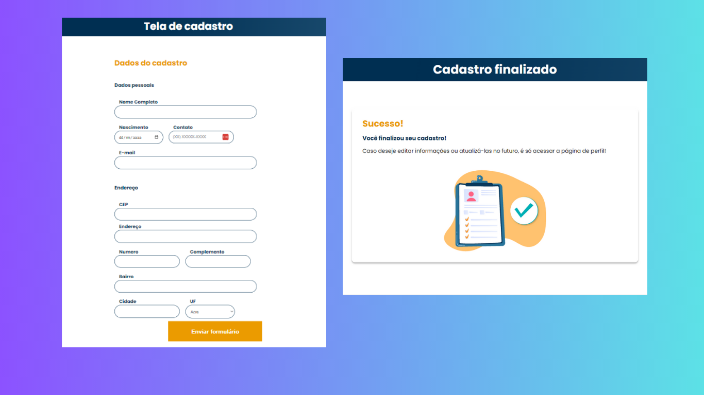

<h1 align="center"> Consumo de API de CEP </h1>

Repositório do treinamento "JavaScript: Consumindo e tratando dados de uma API" promivido pela Alura Cursos Online.

  <a href="#-tecnologias">Tecnologias</a>&nbsp;&nbsp;&nbsp;|&nbsp;&nbsp;&nbsp;
  <a href="#-projeto">Projeto</a>&nbsp;&nbsp;&nbsp;|&nbsp;&nbsp;&nbsp;
  <a href="#-licença">Licença</a>

  

 

  

## 🚀 Tecnologias

Esse projeto foi desenvolvido com as seguintes tecnologias:

- HTML
- CSS
- JavaScript
- API (viacep.com.br)
- Git e Github

## 💻 Projeto

Esse projeto é um treinamento utilizando JavaScript e consumendo dados de uma api de CEP.

## 💻 Licença

Esse projeto está sob a licença MIT.

---

Feito com ♥ 
